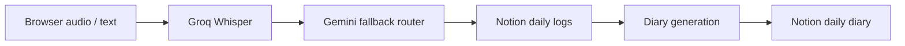

# AI Diary Assistant - `gemini-local`


`gemini-local` runs the Streamlit app locally while still using cloud AI services: Groq Whisper for transcription, Gemini for cleanup and diary generation, and Notion for persistence.

## Purpose

- Local development branch
- Uses `.env` instead of Streamlit Secrets
- Same Gemini + Groq + Notion workflow as `main`
- Lighter setup than `ollama-private`

## Runtime Architecture




## Setup

```bash
git clone https://github.com/NithishKumarAI/AI-Personal-Assistant-System.git
cd AI-Personal-Assistant-System
git checkout gemini-local

python -m venv .venv
.venv\Scripts\activate

pip install -r requirements.txt
copy .env.example .env

streamlit run app.py
```

## Environment Variables

| Variable | Required | Purpose |
|---|---:|---|
| `GROQ_API_KEY` | Yes | Groq Whisper transcription |
| `GEMINI_API_KEY` | Yes | Gemini API access |
| `PRIMARY_MODEL` | At least one model | Gemini fallback chain |
| `SECONDARY_MODEL` | Optional | Gemini fallback chain |
| `TERTIARY_MODEL` | Optional | Gemini fallback chain |
| `NOTION_API_KEY` | Yes | Notion integration |
| `DATABASE_ID` | Yes | Daily Logs database |
| `DAILY_DIARY_DATABASE_ID` | Yes | Daily Diary database |

The implemented Gemini router reads `PRIMARY_MODEL`, `SECONDARY_MODEL`, and `TERTIARY_MODEL`.

## Transcription Flow

Audio is captured through `st.audio_input`, saved as `temp_audio.wav`, and sent to Groq Whisper. The returned transcription is loaded into the journal form for review.

## AI Workflow

- `core/llm.py` builds the cleanup prompt.
- `core/model_router.py` tries configured Gemini models in order.
- Saved logs are fetched from Notion, combined, and sent through the same Gemini routing path for diary generation.
- The diary is created or updated in the Notion Daily Diary database.

## Notion Setup

Create two Notion databases and share both with the integration.

| Database | Required Properties |
|---|---|
| Daily Logs | `Content` title, `Date` date, `Time` rich text |
| Daily Diary | `Diary` title, `Date` date |

Property names are case-sensitive.

## Troubleshooting

| Issue | Check |
|---|---|
| Missing configuration | Copy `.env.example` to `.env` and fill required values |
| Transcription failed | Check `GROQ_API_KEY` and browser microphone permission |
| Gemini fallback failed | Check model names, quota, and `GEMINI_API_KEY` |
| Notion error | Check database IDs, property names, and integration sharing |

## Limitations

- Uses cloud AI services.
- Notion is cloud storage.
- Not the Streamlit Cloud deployment branch.
- Does not use Ollama or local Whisper.
- No Docker or Kubernetes files are implemented for this branch.

## License

MIT. See [LICENSE](LICENSE).
