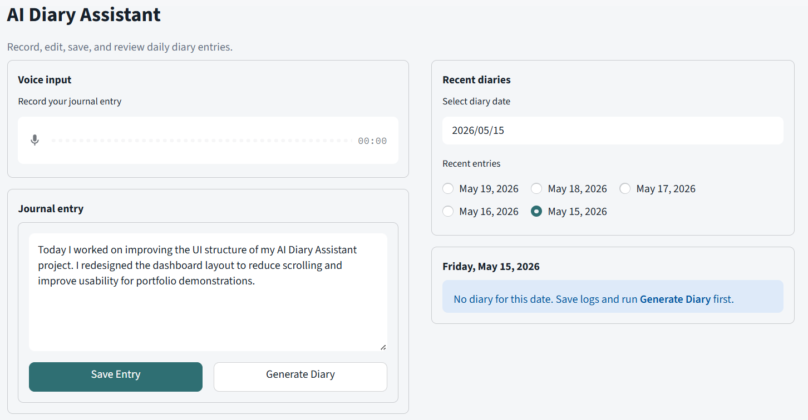
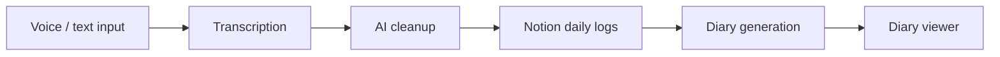
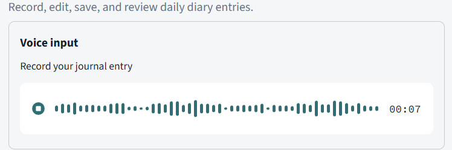
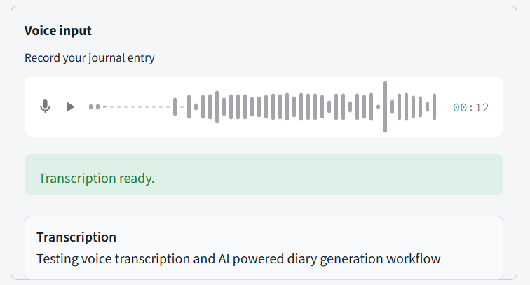
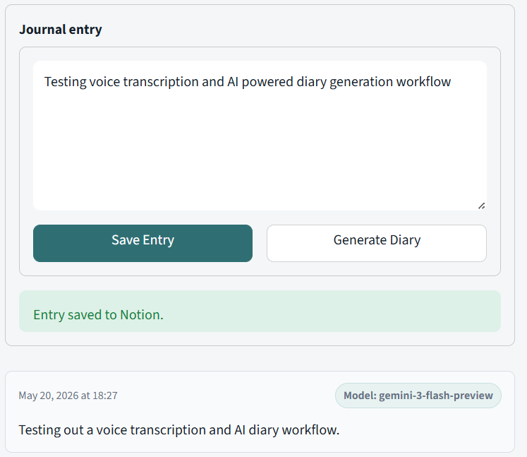
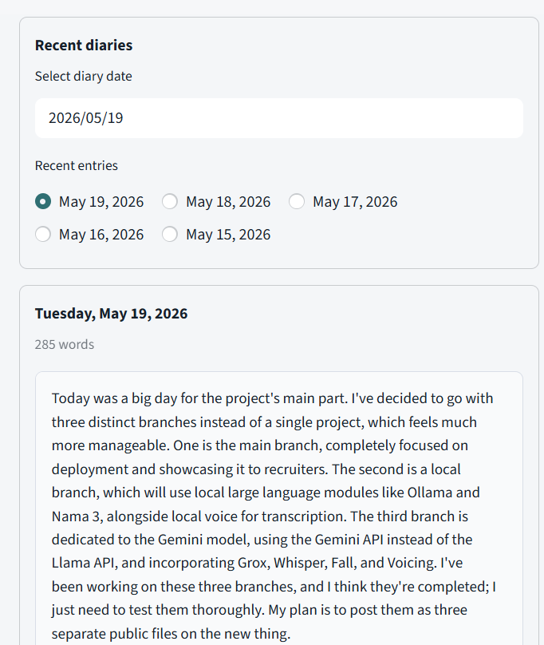
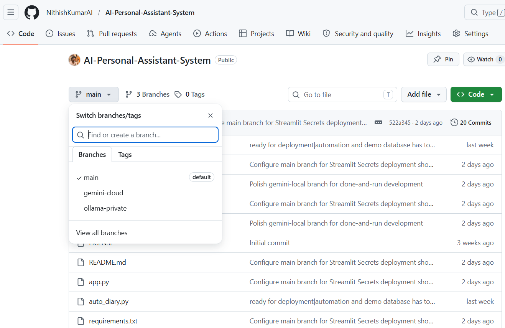

# AI Diary Assistant



A compact Streamlit diary dashboard that records journal notes, transcribes voice input with Groq Whisper, cleans entries with Gemini, and stores daily logs and generated diary entries in Notion.

## Choose Your Runtime

| Branch | Best For |
|---|---|
| `main` | Public demo and deployment showcase |
| `gemini-local` | Easy local setup using Gemini APIs |
| `ollama-private` | Privacy-focused local AI inference |

Open the branch README for setup instructions and runtime-specific details.


## Key Features

- Voice or text journal entry capture
- Groq Whisper transcription
- Gemini cleanup with fallback routing
- Notion-backed daily logs and diary entries
- Daily diary generation from saved logs
- Date-based diary viewer
- Compact Streamlit dashboard UI

## System Architecture




## Screenshots

| Dashboard | Voice Recording |
|---|---|
|  |  |

| Transcription | Journal Entry |
|---|---|
|  |  |

| Diary Viewer | Branches |
|---|---|
|  |  |

## Workflow

1. Record a voice note or type a journal entry.
2. Review the transcription and edit if needed.
3. Clean and save the entry to Notion.
4. Generate a diary from the day's saved logs.
5. Browse generated diary entries by date.

## Quick Start

```bash
git clone https://github.com/NithishKumarAI/AI-Personal-Assistant-System.git
cd AI-Personal-Assistant-System
git checkout main

python -m venv .venv
.venv\Scripts\activate
pip install -r requirements.txt

streamlit run app.py
```

`main` is configured for Streamlit Secrets. Use the branch README files for `gemini-local` and `ollama-private` setup.

## Tech Stack

| Layer | Technology |
|---|---|
| UI | Streamlit |
| Speech-to-text | Groq Whisper |
| LLM | Gemini with fallback routing |
| Storage | Notion API |
| Runtime config | Streamlit Secrets on `main`, `.env` on local branches |

## Security and Privacy

- Do not commit `.env`, `.streamlit/secrets.toml`, API keys, Notion tokens, or private diary data.
- `main` uses cloud services: Groq, Gemini, and Notion.
- `ollama-private` keeps AI inference local, but Notion remains cloud storage.
- Docker exists only in `ollama-private`.
- Kubernetes manifests and GCP deployment are not currently implemented.

## License

MIT. See [LICENSE](LICENSE).
