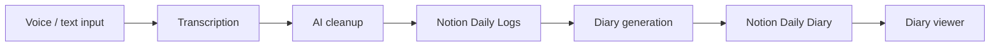

# AI Diary Assistant


A Streamlit-based AI diary assistant for voice journaling, transcription, AI cleanup, diary generation, and Notion-backed storage. The project supports multiple runtimes across Git branches: a deployed cloud version, a local Gemini runtime, and a privacy-focused Ollama runtime.

## Live Demo

[Live Demo URL Here]

The `main` branch is deployed on Google Cloud Run using a Docker image. Secrets are provided through environment variables, and the container is designed to run Streamlit on port `8080`.

## Deployment Status

| Item | Status |
|---|---|
| Dockerized Streamlit app | Implemented |
| Google Artifact Registry workflow | Implemented for deployment |
| Google Cloud Run deployment | Implemented |
| Public production URL | Deployed, add URL above |
| Kubernetes manifests | Not included |

## Choose Your Runtime

This repository contains multiple runtime branches.

| Branch | Best For | Runtime |
|---|---|---|
| `main` | Public demo and deployment showcase | Gemini + Groq + Notion on Google Cloud Run |
| `gemini-local` | Local setup using cloud AI APIs | Gemini + Groq + Notion with `.env` |
| `ollama-private` | Privacy-focused local AI inference | Ollama + Llama3 + local Whisper + Notion storage |

Open the branch README for setup instructions and runtime-specific details.


## Feature Overview

- Compact Streamlit dashboard UI
- Voice recording and text journal entry
- Groq Whisper transcription on cloud branches
- Local Whisper transcription on `ollama-private`
- Gemini cleanup pipeline with fallback routing
- Ollama inference pipeline on `ollama-private`
- Notion Daily Logs and Daily Diary persistence
- AI-generated daily diary summaries
- Date-based diary viewing
- Asia/Kolkata timezone-aware logging
- Docker containerization for Cloud Run deployment

## System Architecture




## Screenshots

| Dashboard | Voice Recording |
|---|---|
|  |  |

| Transcription | Journal Entry |
|---|---|
|  |  |

| Diary Viewer | Branches |
|---|---|
|  |  |

## How To Use

1. Record a voice note or type a journal entry.
2. Review and clean the transcription.
3. Save the entry to Notion.
4. Generate a diary from daily logs.
5. Browse previous diary entries.

## Deployment Architecture

`main` is the deployment branch.

```text
Streamlit app
  -> Docker image
  -> Google Artifact Registry
  -> Google Cloud Run
  -> Runtime environment variables
  -> Gemini, Groq, Notion APIs
```

Deployment uses:

- `Dockerfile` based on `python:3.11-slim`
- Streamlit served on `0.0.0.0:8080`
- Google Artifact Registry for the container image
- Google Cloud Run for hosting
- environment variables for API keys, model settings, and Notion database IDs

No Kubernetes manifests are included in this repository.

## Quick Start

```bash
git clone https://github.com/NithishKumarAI/AI-Personal-Assistant-System.git
cd AI-Personal-Assistant-System
git checkout main

python -m venv .venv
.venv\Scripts\activate
pip install -r requirements.txt

streamlit run app.py
```

For local setup variants, use:

- [`README.gemini-local.md`](README.gemini-local.md)
- [`README.ollama-private.md`](README.ollama-private.md)

## Environment Overview

`main` reads configuration from environment variables or Streamlit secrets.

Required runtime values:

- `GROQ_API_KEY`
- `GEMINI_API_KEY`
- at least one of `PRIMARY_MODEL`, `SECONDARY_MODEL`, `TERTIARY_MODEL`
- `NOTION_API_KEY`
- `DATABASE_ID`
- `DAILY_DIARY_DATABASE_ID`

## Tech Stack

| Layer | Technology |
|---|---|
| UI | Streamlit |
| Speech-to-text | Groq Whisper, local Whisper on `ollama-private` |
| Cloud LLM | Gemini |
| Local LLM | Ollama + Llama3 |
| Storage | Notion API |
| Container | Docker |
| Deployment | Google Artifact Registry + Google Cloud Run |
| Runtime config | environment variables / Streamlit secrets |

## Repository Structure

```text
.
|- app.py
|- Dockerfile
|- core/
|  |- voice.py
|  |- llm.py
|  |- model_router.py
|  |- notion.py
|  |- diary_service.py
|- rag/
|  |- fetch_data.py
|  |- combine_logs.py
|  |- diary_generator.py
|- doc/
|  |- screenshots/
|  |- architecture/
|- README.gemini-local.md
|- README.ollama-private.md
|- requirements.txt
```

## Privacy and Security

- Do not commit `.env`, `.streamlit/secrets.toml`, API keys, Notion tokens, or private diary data.
- `main` and `gemini-local` use cloud AI services.
- `ollama-private` keeps AI inference local, but Notion remains cloud storage.
- Runtime secrets should be configured as Cloud Run environment variables or Streamlit secrets.
- `temp_audio.wav` is a runtime artifact and should not be committed.

## License

MIT. See [LICENSE](LICENSE).
