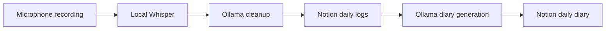

# AI Diary Assistant - `ollama-private`


`ollama-private` is the local/private inference branch. It uses local Whisper for transcription and Ollama + `llama3` for journal cleanup and diary generation. Notion remains the cloud persistence layer.

## Purpose

- Local/private AI runtime
- Ollama instead of Gemini
- Local Whisper instead of Groq Whisper
- `.env` based configuration
- Notion-backed logs and diary entries

## Runtime Architecture




## Setup

```bash
git clone https://github.com/NithishKumarAI/AI-Personal-Assistant-System.git
cd AI-Personal-Assistant-System
git checkout ollama-private

python -m venv .venv
.venv\Scripts\activate

pip install torch
pip install -r requirements.txt
copy .env.example .env

ollama pull llama3
streamlit run app.py
```

Start Ollama if it is not already running:

```bash
ollama serve
```

## Dependencies

- Ollama
- `llama3` model
- FFmpeg
- PyTorch
- Working microphone
- Python packages from `requirements.txt`

## Environment Variables

| Variable | Required | Default | Purpose |
|---|---:|---|---|
| `NOTION_API_KEY` | Yes | None | Notion integration |
| `DATABASE_ID` | Yes | None | Daily Logs database |
| `DAILY_DIARY_DATABASE_ID` | Yes | None | Daily Diary database |
| `OLLAMA_BASE_URL` | No | `http://localhost:11434` | Ollama server URL |
| `OLLAMA_MODEL` | No | `llama3` | Cleanup and diary model |
| `WHISPER_MODEL` | No | `base` | Local Whisper model |
| `FFMPEG_PATH` | No | None | Optional FFmpeg path |

## Transcription Flow

The app records microphone audio with `sounddevice`, saves it to `temp_audio.wav`, and transcribes it with local Whisper. The transcription is shown in the journal form.

## AI Workflow

- `core/llm.py` sends cleanup prompts to Ollama `/api/generate`.
- `rag/diary_generator.py` sends diary generation prompts to Ollama.
- `core/diary_service.py` writes new diary entries or updates the existing Notion diary page for the day.

## Notion Setup

Create two Notion databases and share both with the integration.

| Database | Required Properties |
|---|---|
| Daily Logs | `Content` title, `Date` date, `Time` rich text |
| Daily Diary | `Diary` title, `Date` date |

Property names are case-sensitive.

## Docker

This branch includes a `Dockerfile`.

```bash
docker build -t ai-diary-assistant:ollama-private .
docker run --rm -p 8080:8080 --env-file .env ai-diary-assistant:ollama-private
```

The Dockerfile runs Streamlit, but it does not install or run Ollama, FFmpeg, or PyTorch automatically.

## Troubleshooting

| Issue | Check |
|---|---|
| Missing config | Confirm `.env` contains Notion variables |
| Ollama unavailable | Start Ollama and pull the configured model |
| Whisper fails | Check FFmpeg, PyTorch, and `WHISPER_MODEL` |
| Recording fails | Check OS microphone permissions |
| Notion error | Check database IDs, property names, and integration sharing |

## Limitations

- Notion remains cloud storage.
- Ollama must run separately.
- Local transcription depends on microphone, FFmpeg, PyTorch, and Whisper model availability.
- No Gemini fallback routing is implemented.
- Kubernetes manifests and GCP deployment are not currently implemented.

## License

MIT. See [LICENSE](LICENSE).
